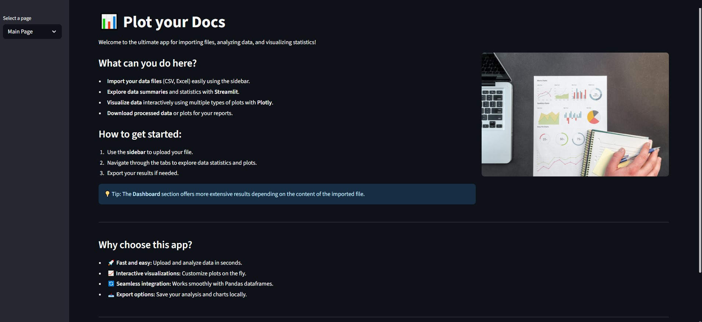
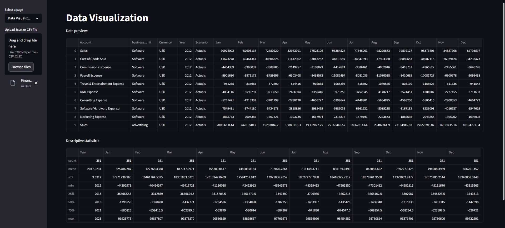
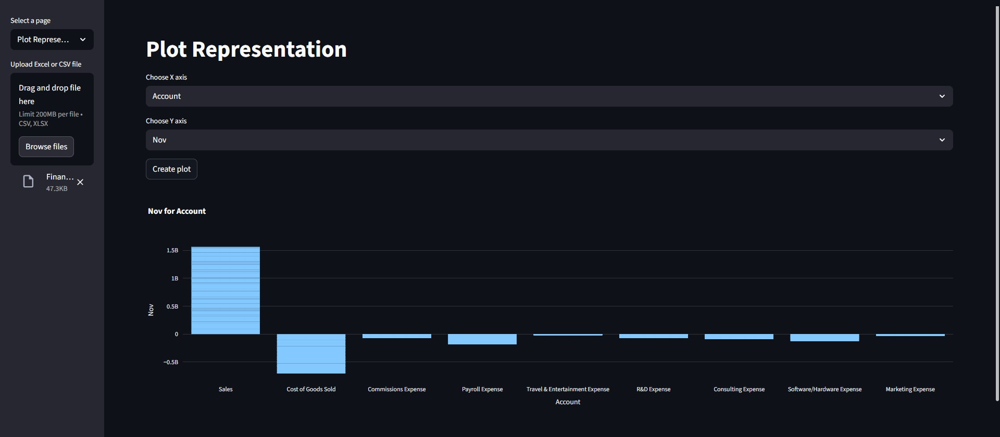
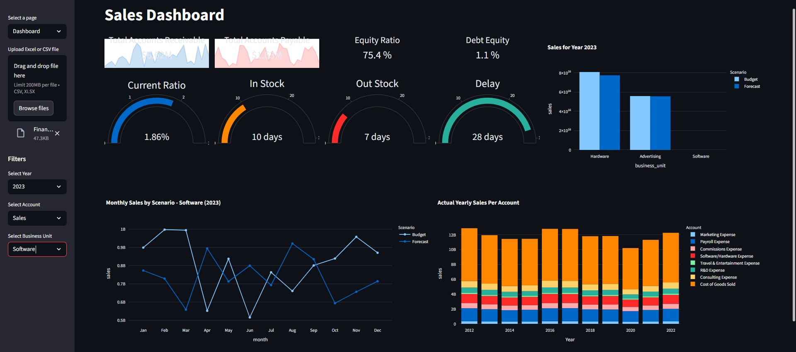

# 📊 Plot your Docs — Turn raw business data into interactive insights

<sub>🗓️ Developed in July 2025</sup> 

**Plot your Docs** is an intuitive and powerful **Streamlit** app designed to import data files, analyze your business statistics, and visualize results through interactive plots and dashboards.

---

## ✅ Features

- Import data files with a specific structure.
- Analyze and manipulate data using **Pandas** and **DuckDB** for efficient queries.
- Interactive visualization using **Plotly** and **Streamlit**.
- Multiple pages for:
  - Data import and overview.
  - Data visualization with customizable charts.
  - Plot representation and insights.
  - A dashboard summarizing key metrics based on monthly data columns.
- Supports files containing the following column structure:  
  Account business_unit Currency Year Scenario Jan Feb Mar Apr May Jun Jul Aug Sep Oct Nov Dec  
  Try out the `Financial Data Clean.xlsx` file :D

---

## 🛠 Installation & Setup  

### 1. Clone the repository
```bash
git clone https://github.com/marcturu/plot-your-docs.git
cd plot-your-docs
```

### 2. Install dependencies

```bash
pip install streamlit pandas plotly duckdb
```

### 3. Run the app locally  
```bash
streamlit run main.py
```
Open your browser and navigate to the displayed local URL (usually http://localhost:8501).  

---

## 📷 Screenshots    

### Main Page:

-
### Data Visualization Page:

-
### Plot Representation Page:

-
### Dashboard Page:

